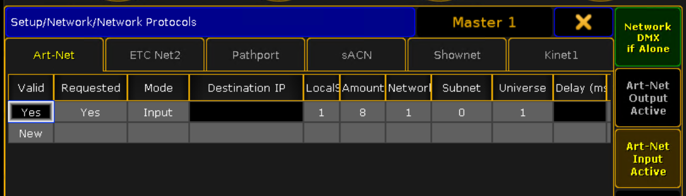
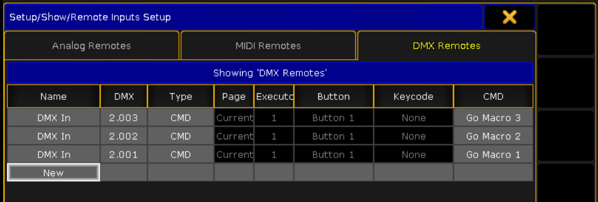

# Serial ArtNet
Connects a serial output device to ArtNET. This script is used to trigger grandMA onPC2 macros from a RF remote.

### How it works

During the start script is catching the USB serial port by PID and VID. RF receiver outputs the bytes as hex strings to the serial port when remote is sending the packets and triggers the ArtNet channel (put max on one channel per packet). onPC2 is configured to remote control using DMX on a spare universe and triggers a macros.

### Description

**debug.py** shows serial output. Use it to catch the packets and assign them to ArtNet channels in config. It shows the output of the reciever as bytes converted to hex strings. This hex string shoud be mapped to channel num in **dev_remote.ini**. 

```01 = ab2e6b864ad5``` means that packet `ab2e6b864ad5` will flash ArtNet channel `1`.

**daemon.py** recieve packets in a loop, triggers ArtNet channels according to mapped packets in **dev_remote.ini** `[ACTIONS]` section.

### Python dependencies
```
pip install stupidartnet
pip install pyserial
```

### Configuring onPC2 to accept external ArtNet input

In some cases and networks you'll need to [create a virtual network interface](https://learn.microsoft.com/en-us/troubleshoot/windows-server/deployment/microsoft-loopback-adapter-rename) with ArtNet ip ranges (2.x.x.x or 10.x.x.x), to make it work. If your current network setup is 192.168.x.x probably you should to this.

Also, when onPC is launching it grabs the serial port to use it for GPS, and this script will not connect to it. To disable serial port reservation you'll need to disable this in windows registry:

`HKEY_CURRENT_USER\SOFTWARE\MA Lighting Technologies\grandMA2 onPC\Settings`

`CheckComport` shoud be set to `0`

### Enabling Artnet input inside onPC2

pnPC2 should be accept ArtNet input, and input should be enabled. 

`Setup > Network Protocols > Art-Net tab`



Universe param should be set to `1`

### Map ArtNet chan to onPC2 macro

`Setup > Remote input setup > DMX remotes tab`



Channels from `Universe 2` is mapped to macros. When the remote button is pressed, channel put on max, and action triggers. 

You can use free [ArtNetView](https://artnetview.com/) to check if triggering is working on a system level and use DXM sheet inside onPC to check if onPC see the triggers. 

### How to install it as a service on Windows ([more on this](https://stackoverflow.com/a/46450007)):

1. Download [nssm.exe](https://nssm.cc/builds)

2. Open a Win prompt as admin

3. ```cmd
   nssm.exe install ProjectService
   ```

4. A popup will be shown.

5. Path to the python file should look like this  ```c:\path\to\python.exe" "c:\path\to\project\serial_to_artnet\daemon.py"```

### How to start service

```cmd
nssm.exe start ProjectService 
```

### How to stop service

```cmd
nssm.exe stop ProjectService
```

### How to remove service:

```cmd
nssm.exe remove ProjectService confirm
```
